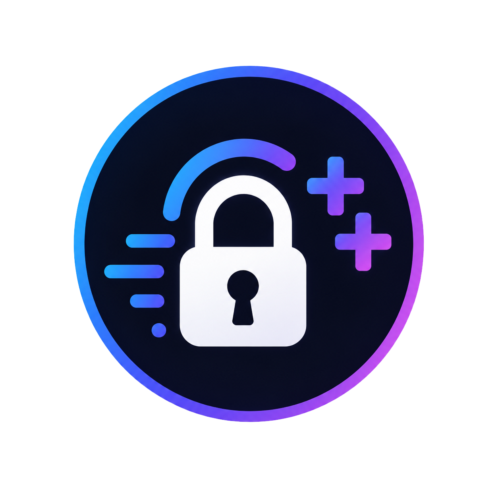
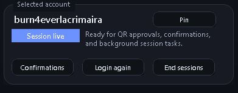
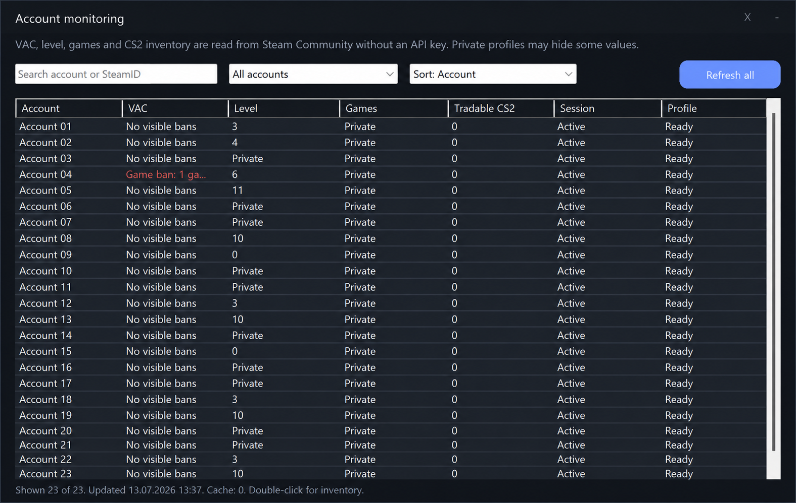
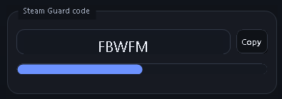
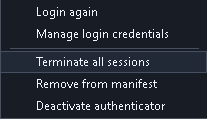
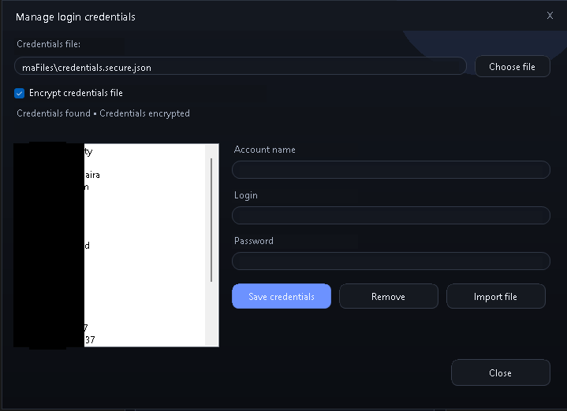
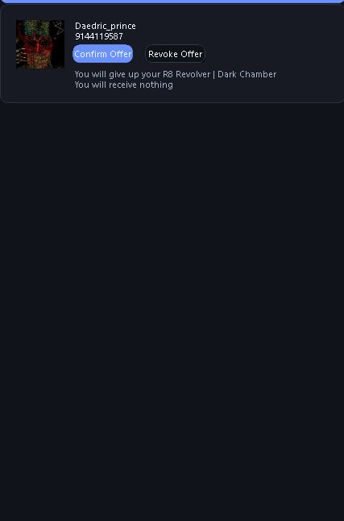
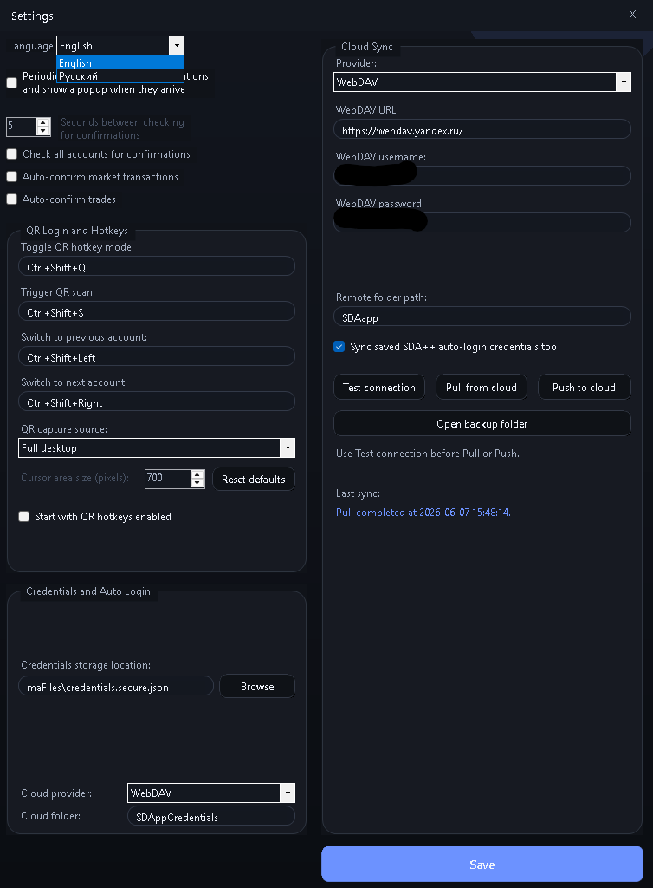

# Steam Desktop Authenticator ++

<p align="center">
  
</p>

<p align="center">
  SDA++ is a modern Windows fork of Steam Desktop Authenticator for Steam Guard two-factor authentication, account management, QR login, cloud synchronization, and session recovery.
</p>

<p align="center">
  
  
  
  
</p>



Originally based on Steam Desktop Authenticator.  
Now developed as the independent **SDA++** project.

## What's new in SDA++

Compared to the original SDA:

- QR-code login from desktop screenshots
- Hotkey-based account switching
- Automatic session recovery
- Cloud synchronization improvements
- Separate credential vault support
- Enhanced account management tools
- Updated dark UI
- All-account monitoring for VAC, level, games, session health, and tradable CS2 inventory
- Unified confirmations across loaded accounts
- Batch auto-login and configurable recovery hotkeys

## Features

- QR-code login directly from the desktop
- Automatic account switching with hotkeys
- Session recovery utilities
- Saved credentials manager for automatic re-login
- Separate cloud synchronization for `.maFile` data and saved credentials
- WebDAV cloud storage support
- Improved Russian localization
- Updated dark-themed interface
- Portable build with no installation required
- Searchable and sortable account monitoring without a Steam Web API key
- Tradable-only CS2 inventory view with untradeable medals and items excluded
- All-account confirmations with account-safe approve and reject actions
- Automatic update checks at startup and every six hours
- Validated cloud restore with preflight checks, local backup, atomic replacement, and automatic rollback
- Bidirectional encrypted WebDAV setup with SDA++ Mobile from the first-run screen or **Account tools**

### One-scan mobile pairing

On a fresh installation, choose **Connect cloud from SDA++ Mobile with one scan**. Pairing remains available later from **Account tools > Connect SDA++ Mobile**, where you can send WebDAV settings in either direction. Scan the two-minute QR code with SDA++ Mobile and enter the separate eight-character one-time code shown by the desktop. SDA++ tries the local network first and automatically falls back to its HTTPS relay when direct LAN access is unavailable.

Pairing uses ephemeral P-256 ECDH and AES-256-GCM. Steam secrets, account files, and vault keys are never placed in the QR or pairing payload. The relay only sees ciphertext, limits each random session to 64 KiB and two minutes, and deletes the payload after its first successful download. The received password is protected with Windows DPAPI, after which SDA++ offers its validated backup-first Cloud Pull. Manual WebDAV setup remains available.

### Safe cloud restore

Cloud Pull now downloads and validates the complete remote vault before changing local data. SDA++ checks manifest entries, filenames, SteamIDs, account payloads, encryption metadata, duplicate entries, and the optional credentials document. A summary is shown before confirmation, the current vault is backed up, and `manifest.json` is committed last. If a disk operation fails, SDA++ restores the previous files automatically.

### Update checks

SDA++ checks the latest GitHub Release after startup and every six hours while it is running. When a newer version is available, SDA++ displays a download prompt and the footer links directly to the portable ZIP. SDA++ never replaces or launches executables automatically, and a failed network request never interrupts Steam Guard.

## Account Monitoring

Open **Monitor** from the main navigation to inspect all loaded accounts in one place. SDA++ reads public Steam Community data without requiring a Steam Web API key and shows:

- VAC and visible ban status
- Steam level and game count
- current SDA++ session health
- total tradable CS2 inventory items
- private-profile and request-error states

The dashboard supports account/SteamID search, attention and session filters, sorting, and a five-minute cache. Double-click an account to open its tradable CS2 inventory. Medals and all other untradeable items are intentionally excluded.



## Multi-account Recovery and Confirmations

**Account tools > Auto login all accounts** restores available sessions using the encrypted credentials vault. The confirmations view combines confirmations from every loaded account and labels each action with its originating account.

Default hotkeys:

- `Ctrl+Shift+L` runs auto-login for all accounts
- `Ctrl+Shift+C` opens confirmations for all accounts

## Interface Tour

### Steam Guard code



Shows the current rotating Steam Guard code and the progress bar until the next refresh.

### Selected account


Displays the current account status, session health, and quick actions for confirmations, re-login, and ending sessions.

### Pin account


Pinned accounts stay at the top of the account list so frequently used accounts are easier to reach.

### Account tools



The account tools menu gives quick access to re-login, login credential management, session termination, manifest cleanup, and authenticator deactivation.

### Manage login credentials



This window stores encrypted login credentials used for automatic re-login and batch session recovery.

### Trade confirmations



Lets you approve or revoke trade and market confirmations directly from the desktop client.

### Settings, cloud sync, language, and hotkeys



Settings includes language selection, confirmation polling, QR hotkeys, account switching shortcuts, WebDAV cloud sync, and separate credential vault sync options.

### Steam QR hotkeys overlay


This floating overlay appears when the QR hotkey system changes state. It confirms whether QR hotkeys are enabled or disabled and shows the result of the last hotkey action.

### Account switching hotkeys

SDA++ supports fast account navigation with keyboard shortcuts:

- `Ctrl+Shift+Left` switches to the previous account
- `Ctrl+Shift+Right` switches to the next account

These shortcuts make it easy to move through multiple accounts without touching the mouse.

## Download

Download the latest portable version from [GitHub Releases](https://github.com/ManeWreck/SDA-plus-plus/releases).

Project page: [SDA++ for Steam Guard on GitHub Pages](https://manewreck.github.io/SDA-plus-plus/).

Current release asset:

- `SDA++-1.7.0-portable.zip`

## Quick Start

1. Download `SDA++-1.7.0-portable.zip` from the Releases section.
2. Extract the archive.
3. Run `SDA++.exe`.
4. Create or import your Steam Guard account.
5. Configure cloud synchronization if desired.

## Security

SDA++ stores Steam Guard data locally.

This executable is currently unsigned, so Windows may show an `Unknown publisher` warning on first launch.

The public release package does not contain:

- personal Steam Guard files (`.maFile`)
- saved account credentials
- cloud synchronization credentials
- backup archives
- user-generated runtime data

Always keep encrypted backups of your Steam Guard files.

Every GitHub Release includes a matching `.sha256` file generated from the exact published ZIP.

## Repository Layout

```text
.
|-- docs/
|-- open-source/
|   |-- SteamDesktopAuthenticator.sln
|   |-- Steam Desktop Authenticator/
|   `-- lib/
|-- portable-exe/
|   |-- SDA++.exe
|   |-- maFiles/
|   `-- ...
|-- LICENSE
`-- README.md
```

## Building From Source

Requirements:

- [.NET 8 SDK](https://dotnet.microsoft.com/download/dotnet/8.0)
- Visual Studio 2022 or another compatible .NET build environment

Build:

```powershell
dotnet build .\open-source\SteamDesktopAuthenticator.sln -c Release
```

GitHub Actions runs the same Windows Release build for every push and pull request. It also rejects account secrets from tracked files and generated portable packages. Tags matching `v*` create or update a GitHub Release with a clean portable ZIP.

## Disclaimer

SDA++ is an unofficial Steam Guard desktop application inspired by the original Steam Desktop Authenticator project and is not affiliated with Valve or Steam.

Use it at your own risk and always keep secure backups of your authentication files.

## Credits

- Based on Steam Desktop Authenticator
- Extended and developed as the independent SDA++ project
